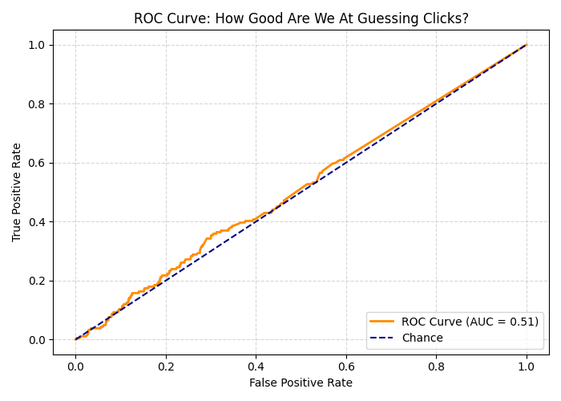

# AdSmart: Campaign Performance Analytics 

Welcome to **AdSmart**, where we turn *fake ad campaigns* into *real data science flexes*.

This project is my way of saying: “Hey, I may not have 10 years of experience — but I *do* know how to simulate a campaign, slice some data, test a hypothesis, and wrangle a stubborn regression model into telling me something useful.”

Inspired by companies(and honestly, any team doing cool work at the intersection of **ads, machine learning, and analytics**), AdSmart shows how I think, experiment, and tell stories with data.
---

## Project Goal

To simulate and analyze digital ad campaign performance using first-party user data, develop metrics that actually mean something, and apply statistical + ML tools to figure out what’s working, what’s tanking, and what to do about it.

Think of this as a mock performance marketing lab — minus the drama of a real budget and the pressure of a quarterly review.

--- 

## Tech Stack & Tools

- **Python** (Pandas, NumPy, Seaborn, Scikit-learn)
- **SQL-style querying** (Pandas for now — SQLite if I get fancy)
- **Jupyter Notebook** (where all the action happens)
- **Streamlit or Dash** (optional dashboard, still deciding if it vibes)
- **GitHub** (obviously)

---

## What You'll Find Here

notebooks/         # Data exploration, experiments, modeling — all the magic ⤷ Includes full ML pipeline, confusion matrix, ROC curve, and commentary
data/              # Simulated raw & processed campaign data  
src/               # Python scripts to keep things modular  
visuals/           # Graphs, charts, and maybe a few witty annotations  
dashboard/         # (Optional) Streamlit app in the works

---

## 📊 Key Metrics Tracked

| Metric | What It Tells Us |
|--------|------------------|
| CTR    | Are people even noticing this thing? |
| CVR    | Are they doing what we hoped after clicking? |
| ROAS   | Are we getting our money’s worth? |
| CAC    | How much did it cost to get one loyal human? |

These are the kinds of questions that keep campaign managers up at night. Fortunately, I recently realized I enjoy figuring them out.

---

## Experiments & Analysis

- Synthetic user & campaign data generation
- Custom KPI framework for performance insights
- A/B testing simulations with real statistical rigor
- Regression modeling to find performance drivers
- Visual funnel analysis with conversion drop-off rates  
- Random Forest classifier to predict click-through likelihood  
- Confusion matrix and ROC curve for model evaluation  
---
## Predictive Modeling: Click Classifier
To spice things up, I trained a Random Forest classifier to predict whether a user would click an ad based on:

- Region  
- Device  
- Bid strategy  
- Campaign-level metadata  

**Outputs:**
- Confusion Matrix (aka: "Did we catch the clickers?")
- ROC Curve to evaluate model performance
- Classification Report with precision/recall/f1 scores

It’s not perfect (yet), but hey — I’m learning. And this project shows my willingness to take on challenges beyond the usual dashboards.

## Why This Exists

Because learning by building is my favorite form of rebellion.  
Because analytics is more than just numbers — it’s storytelling with evidence.  
And because I want to show what I can do before I’m handed a title that says I already can.

---
## Common Advertising + Analytics Abbreviations (For Newbies and the Curious)
Because no one is born knowing what ROAS means.

| Abbreviation | Stands For                    | What It Means (Real-World Edition) |
|-------------|--------------------------------|------------------------------------|
| **CTR**     | Click-Through Rate             | Of all the people who saw the ad, how many clicked it? |
| **CVR**     | Conversion Rate                | Of those who clicked, how many did what we wanted (buy, sign up, etc.)? |
| **CPA**     | Cost Per Acquisition           | How much did we pay to gain *one* customer, lead, or signup? |
| **CPC**     | Cost Per Click                 | How much money left our budget each time someone clicked? |
| **ROAS**    | Return on Ad Spend             | For every $1 we spent, how much money came back? ($3 ROAS = $3 earned per $1 spent) |
| **KPI**     | Key Performance Indicator      | A fancy name for any metric that actually matters |
| **A/B Test**| Split Test                     | A head-to-head matchup between two options (like "Should we use a cat pic or a dog pic in the ad?") |

These are the acronyms you'll hear in marketing and product meetings that sound scary at first, but are actually just shorthand for *common-sense questions* like:
> “Did it work?”  
> “Was it worth it?”  
> “Can we do better?”
---
## 💻 Launch the Dashboard

Run this Streamlit dashboard to explore metrics and visuals:

```bash
streamlit run dashboard/app.py
```
---

## Visual Insights

Here’s how performance drops off through the user journey — from impressions to clicks to conversions:


And here’s how well our click prediction model performs:


---

## About Me

Created by **Pearl Senza Sikepe**, an analytics-minded, insight-chasing, metric-bending explorer of data with a soft spot for clarity, fairness, and useful tech.

Email: ps3358@columbia.edu

Connect with me on [LinkedIn](https://www.linkedin.com/in/pearl-s-041a1178/)
---

> No budgets were harmed in the making of this project. All data is simulated. But the insights? 100% real.
